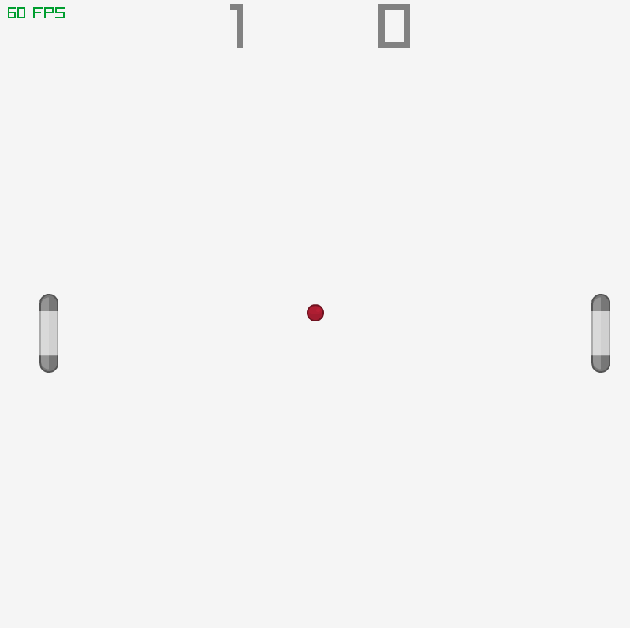

# rayPong

<p align=center>
    
</p>

> [!Warning]
> The purpose of this is to get a basic understanding of raylib. Lower your expectations.

## The Game

A basic, classic pong game. The game has only been tested on Ubuntu 22.04.

Most of this is based off of: [raylib intro course](https://github.com/raysan5/raylib-intro-course), definitley check that out.

## Building on Linux/MacOS

```
mkdir build ; cd build
cp -r ../src/assets .
cmake ..
make
./rayPong
```

Note that `raylib` as a library will be fetched by the CMake build if it is not on your system.

## Controls

The player controls can be changed at the definitions in `main.c`, the defaults are:
- Player 1:
    - "M" up
    - "N" down
- Player 2:
    - "Q" up
    - "E" down

The game can ge paused with "p"
